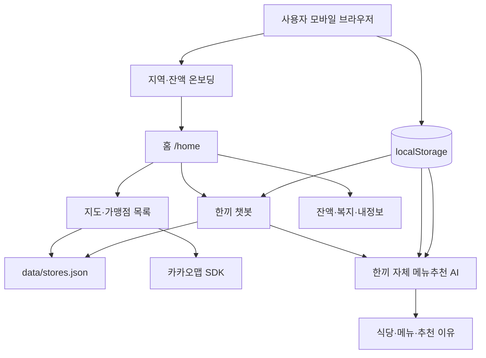
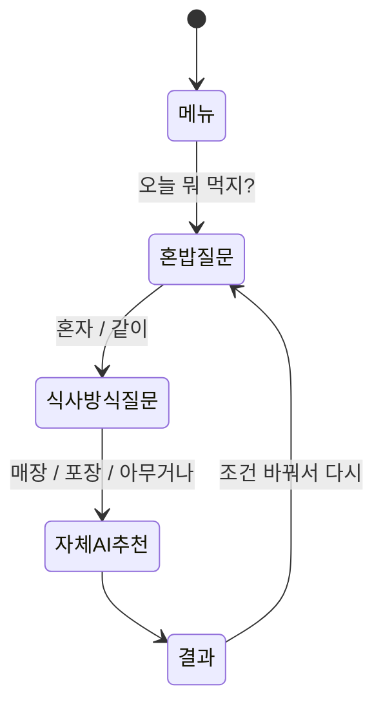

# 한끼 웹앱 개발 구조와 챗봇·메뉴 추천 AI

> 작성 기준: 2026-08-18, Git 커밋 `6db7292` 이후 구현 상태  
> 운영 주소: <https://child-meal-card-service.vercel.app>

## 1. 서비스 개요

한끼는 춘천시 아동급식카드 사용자가 현재 이용 가능한 가맹점을 찾고, 예산과 최근 식사, 영양 균형, 개인 만족도를 바탕으로 메뉴를 추천받는 모바일 웹앱이다.

핵심 기능은 다음과 같다.

- 지역과 카드 잔액 입력
- 카카오맵 기반 가맹점 탐색
- 영업 여부·거리·예산·혼밥·포장 조건 필터
- 최근 식사 기반 영양 균형 추천
- 만족도 기반 브라우저 개인화
- 챗봇을 통한 조건형 메뉴 추천
- 편의점 식사 조합, 잔액 계획, 복지 정보

## 2. 기술 구성

| 구분 | 기술 및 역할 |
|---|---|
| 프런트엔드 | Next.js 16 App Router, React 19, TypeScript |
| 스타일 | `한끼_웹앱_v10.html`을 기준으로 이식한 CSS |
| 지도 | 카카오맵 JavaScript SDK |
| 가맹점 데이터 | `data/stores.json` 정적 JSON, 총 1,372개 가맹점 |
| 사용자 데이터 | 브라우저 `localStorage` |
| 메뉴추천 AI | 브라우저에서 실행되는 영양·만족도 기반 자체 추천 엔진 |
| 배포 | GitHub `main` 푸시 → Vercel 자동 배포 |

원본 디자인 파일 `docs/prototypes/한끼_웹앱_v10.html`은 수정하지 않는다. Next.js 페이지와 `app/globals.css`에서 원본 디자인을 재현한다.

## 3. 전체 구조



## 4. 주요 폴더와 책임

```text
app/
├─ onboarding/                  지역·금액·완료 화면
├─ home/page.tsx                실제 홈 화면
├─ result/page.tsx              지도와 가맹점 검색 결과
├─ chat/page.tsx                챗봇 화면과 AI API 호출
├─ store/[id]/page.tsx          가맹점 상세
├─ balance/, welfare/, me/      잔액·복지·내정보
└─ globals.css                  전체 화면 스타일

components/
├─ map/KakaoMap.tsx             카카오맵 표시
├─ sheets/VisitSheet.tsx        식사 메뉴·만족도 기록
├─ sheets/ReportSheet.tsx       결제 실패 신고와 대체 추천
└─ store/StoreDetailClient.tsx  상세 화면과 방문 기록 연결

lib/
├─ chatEngine.ts                챗봇 상태 전이와 기본 추천
├─ ranking.ts                   식당 종합 점수와 정렬
├─ nutrition.ts                 메뉴명 기반 영양 추정
├─ mealLog.ts                   과거 식사 기록 호환 변환
├─ stores.ts                    영업 여부·거리·가맹점 조회
├─ taxonomy.ts                  음식군과 기본 점수
├─ hooks/useMealLog.ts          최근 식사 7회 저장
├─ hooks/useMealFeedback.ts     만족도 최근 30회 저장
└─ hooks/createPersistentState.ts localStorage 공통 저장소
```

## 5. 진입과 온보딩

기본 주소 `/`에 접속하면 `proxy.ts`가 항상 `/onboarding/dong`으로 보낸다.

```text
/ → 지역 선택 → 금액 입력 → 완료 → /home
```

온보딩을 완료하면 `hanki_visit_started` 세션 쿠키가 생성된다. 같은 방문 중에는 홈·지도·챗봇·내정보를 자유롭게 이동할 수 있다. 앱 내부 홈 버튼은 `/`이 아니라 `/home`을 사용한다.

지역과 잔액은 `localStorage`에 저장하므로 다음 방문에도 이전 값이 남아 있지만, 기본 주소로 다시 접속하면 온보딩 화면은 다시 표시된다.

## 6. 브라우저 저장 데이터

현재 회원가입과 서버 데이터베이스는 없다. 개인 데이터는 사용 중인 브라우저에만 저장된다.

| 데이터 | 저장 목적 | 보관 범위 |
|---|---|---|
| 지역 | 가맹점 필터와 거리 기준 | 마지막 선택값 |
| 잔액 | 일일 권장 사용액 계산 | 마지막 입력값 |
| 최근 식사 | 영양 균형과 반복 감점 | 최근 7회 |
| 만족도 | 개인 취향 학습 | 최근 30회 |
| 즐겨찾기 | 단골 가게 표시 | 사용자가 해제할 때까지 |
| 결제 신고 | 위험 가맹점 감점 | 브라우저 데이터가 유지되는 동안 |
| 알림·프로필 | 화면 설정과 복지 필터 | 마지막 선택값 |

브라우저 데이터 삭제, 시크릿 모드 종료, 다른 기기 사용 시 개인화 기록이 이어지지 않는다.

## 7. 챗봇 작동 방식

### 7.1 챗봇은 두 부분으로 구성된다

1. 대화 흐름과 자유문장 의도 분류
2. 한끼 자체 메뉴추천 AI의 최종 식당·메뉴 선택

자유문장 자체를 LLM에 전송해 대화하는 범용 챗봇은 아니다. 현재 자유문장 의도는 `lib/chatEngine.ts`의 정규식으로 분류한다.

| 입력 예시 | 분류 결과 |
|---|---|
| 먹고 싶어, 메뉴 추천, 점심 | 음식 추천 |
| 편의점, 도시락, 삼각김밥 | 편의점 조합 |
| 잔액, 얼마 남았어 | 잔액 |
| 혜택, 복지, 지원 | 복지 |
| 동네, 지역, 위치 | 지역 변경 |
| 이월, 소멸, 규정 | 잔액 소멸 안내 |

분류되지 않은 문장은 지원 기능을 선택할 수 있는 빠른 버튼을 보여준다.

### 7.2 음식 추천 대화 상태



사용자가 마지막 조건을 선택하면 `app/chat/page.tsx`가 브라우저에 저장된 다음 정보를 자체 추천 엔진에 전달한다.

- 선택 지역
- 혼자 또는 같이 먹는지
- 매장 식사, 포장 또는 무관
- 최근 식사 7회
- 만족도와 불만족 이유 최대 30회
- 가맹점 결제 실패 신고
- 시연용 시간 설정

추천은 브라우저에서 즉시 계산되며 외부 AI 서버로 데이터를 전송하지 않는다.

## 8. 메뉴 추천 시스템

현재 추천 시스템은 두 층으로 구성된 자체 개인화 방식이다.

```text
1단계: 안전한 후보 필터
2단계: 영양·거리·개인화 학습 점수로 최종 선택
```

### 8.1 후보 필터

추천 전에 다음 조건으로 후보를 제한한다.

1. 선택한 동네의 가맹점
2. 현재 영업 중인 식당
3. 일반 추천에서는 편의점 제외
4. 포장 선택 시 포장 가능 식당 우선
5. 혼자 선택 시 혼밥 가능 식당 우선
6. 1만 원 이하 메뉴가 있는 식당

포장 또는 혼밥 조건에 맞는 식당이 하나도 없으면, 결과가 완전히 사라지지 않도록 영업 중 후보로 완화한다.

### 8.2 음식군 기본 점수

`lib/taxonomy.ts`의 음식군 기본 점수는 다음과 같다.

| 음식군 | 기본점수 |
|---|---:|
| 백반·정식 | 10 |
| 국·찌개 | 9 |
| 구이·볶음 | 8 |
| 양식·돈까스 | 7 |
| 일식 | 7 |
| 중식 | 6 |
| 분식 | 5 |
| 베이커리 | 5 |
| 편의점 | 2 |

같은 음식군을 최근에 먹은 횟수마다 2점을 감점한다.

### 8.3 영양 추정

가맹점 원본 데이터에는 실제 메뉴판이 없다. 가게명으로 업종을 명확히 판단할 수 있는 곳과 중식·일식·제과점 등 등록 업종이 구체적인 곳에만 예상 메뉴를 배정한다. 판단하기 어려운 가게는 `메뉴 확인 필요`로 표시하고 메뉴추천 AI 후보에서 제외한다. 예상 메뉴에도 공식 영양성분표가 없으므로 영양소의 정확한 g·mg 수치를 만들지 않는다. `lib/nutrition.ts`가 메뉴명과 음식군의 키워드로 다음 항목을 `낮음·보통·높음`으로 추정한다.

- 단백질
- 채소
- 탄수화물
- 나트륨
- 당
- 지방

예시는 다음과 같다.

- 고기·닭·생선·두부·계란 → 단백질 높음 추정
- 비빔·샐러드·채소·나물·쌈 → 채소 높음 추정
- 국·찌개·탕·라면·짬뽕 → 나트륨 높음 추정
- 케이크·도넛·와플·음료 → 당 높음 추정
- 튀김·치킨·돈까스·피자 → 지방 높음 추정

이 결과는 추천용 정성 추정이며 의료·영양 진단이나 실제 영양성분표가 아니다.

### 8.4 최근 식사 기반 영양 보완

최근 메뉴 최대 5개의 추정 영양 패턴을 계산한다.

- 최근 단백질 평균이 낮으면 단백질이 높은 메뉴 가점
- 최근 채소 평균이 낮으면 채소가 높은 메뉴 가점
- 최근 나트륨 평균이 높으면 나트륨이 높은 메뉴 감점
- 최근 당 평균이 높으면 당이 높은 메뉴 감점
- 나트륨·당·지방이 높은 메뉴에는 기본 감점

각 식당에서 예산 이하 메뉴를 우선 대상으로 삼고, 영양·개인화 점수가 같으면 더 저렴한 메뉴를 선택한다.

### 8.5 거리와 결제 신뢰도

실제 GPS가 아니라 선택한 동네 가맹점 좌표의 중심점을 사용자 기준 위치로 사용한다. 거리는 Haversine 공식으로 계산한다.

기본 거리 감점은 다음 형태다.

```text
거리 감점 = 거리(m) ÷ 400
```

결제 실패 신고가 2건 이상인 가맹점은 `확인 중`으로 처리한다.

- 정렬 단계에서 정상 가맹점 뒤로 이동
- 추천 점수에서 추가 6점 감점

## 9. 만족도 기반 브라우저 개인화

### 9.1 기록 흐름

가맹점 상세에서 길찾기를 누른 뒤 방문 기록 시트가 열린다.

```text
실제 메뉴 선택
→ 만족 / 보통 / 아쉬움
→ 아쉬운 이유 선택
→ localStorage 저장
→ 다음 추천부터 반영
```

아쉬운 이유는 다음 여섯 종류다.

- 입맛에 맞지 않음
- 거리가 멂
- 가격 부담
- 양 부족
- 너무 자극적임
- 비슷한 메뉴 반복

### 9.2 점수 반영

| 피드백 | 다음 추천 변화 |
|---|---|
| 특정 메뉴 만족 | 같은 메뉴 점수 상승 |
| 특정 음식군 만족 | 같은 음식군 점수 상승 |
| 특정 식당 만족 | 같은 식당 점수 상승 |
| 거리 불만 | 모든 후보의 거리 감점을 강화해 가까운 곳 우선 |
| 가격 불만 | 비싼 메뉴 감점을 강화 |
| 자극성 불만 | 나트륨 높음 추정 메뉴 감점 |
| 반복 불만 | 같은 음식군 반복 감점 강화 |
| 양 부족 | 단백질 낮음 추정 메뉴 감점 |

만족도는 `1`, 보통은 `0`, 아쉬움은 `-1`로 저장한다. 최근 평가일수록 더 높은 가중치를 사용한다. 따라서 외부 AI API가 없어도 사용할수록 추천 순서가 달라진다.

## 10. 식당 종합 점수

`lib/ranking.ts`의 개념적인 최종 식당 점수는 다음과 같다.

```text
식당 점수 =
  음식군 기본점수
  + 가장 적합한 메뉴의 영양 점수
  + 음식군·식당 만족도 점수
  - 최근 같은 음식군 반복 횟수 × 2
  - 개인화된 거리 감점
  - 가격 불만에 따른 가격 감점
  - 결제 확인 중 감점
```

점수는 절대적인 건강 등급이 아니라 후보 간 정렬을 위한 상대값이다.

## 11. 한끼 자체 메뉴추천 AI

한끼의 메뉴추천 AI는 대규모 언어 모델이나 외부 생성형 AI가 아니다. 식사 이력과 만족도에 따라 가중치를 바꾸는 설명 가능한 개인화 추천 엔진이다.

### 11.1 실행 위치

추천 계산은 사용자의 브라우저에서 실행된다.

- 별도 AI API 키 불필요
- 호출 횟수 제한 없음
- 추천 요청 비용 없음
- 네트워크가 불안정해도 정적 가맹점 데이터가 로드된 뒤 추천 가능
- 최근 식사와 만족도는 외부 AI 업체에 전송하지 않음

### 11.2 추천 처리 순서

`lib/chatEngine.ts`, `lib/ranking.ts`, `lib/nutrition.ts`가 다음 순서로 작동한다.

1. 지역과 현재 영업 여부로 식당 후보 생성
2. 혼밥·포장·예산 조건 적용
3. 최근 식사 7회의 메뉴와 음식군 분석
4. 메뉴명 기반 영양 특성 추정
5. 만족도 최근 30회와 불만족 이유 분석
6. 음식군·영양·거리·가격·결제 신뢰도 점수 계산
7. 식당별로 가장 적합한 예산 이하 메뉴 선택
8. 종합점수가 가장 높은 식당과 메뉴 반환

추천 엔진은 `data/stores.json`에 실제로 존재하는 식당과 메뉴만 선택하므로 존재하지 않는 결과를 생성하지 않는다.

### 11.3 학습의 의미

현재의 학습은 신경망 재훈련이 아니라 사용자 피드백에 따라 추천 가중치를 갱신하는 온라인 개인화다.

- 만족한 메뉴·음식군·식당 가중치 상승
- 아쉬웠던 메뉴·음식군·식당 가중치 하락
- 거리 불만이 쌓이면 거리 감점 강화
- 가격 불만이 쌓이면 고가 메뉴 감점 강화
- 자극성·반복·양 부족 이유에 맞는 영양 특성 감점
- 과거 평가보다 최근 평가에 더 높은 비중 부여

이 방식은 데이터가 적은 초기에는 기본 영양 규칙을 사용하고, 평가가 쌓일수록 사용자 취향의 비중이 커지는 구조다.

### 11.4 자체 AI의 경계

한끼 자체 AI는 다음 작업을 하지 않는다.

- 사람처럼 자유문장을 생성하는 범용 대화
- 정확한 영양성분 수치 예측
- 질환에 대한 식단 처방
- 서버에서 여러 사용자의 데이터를 합친 모델 학습

따라서 문서와 화면에서는 `개인화 추천 AI`, `자체 메뉴추천 AI`로 표현하며, 생성형 AI 또는 의료 AI로 설명하지 않는다.

## 12. 지도와 거리

카카오맵은 추천 모델이 아니라 지도 표시와 외부 길찾기에 사용한다.

- `NEXT_PUBLIC_KAKAO_MAP_KEY`: 브라우저 지도 표시
- `KAKAO_REST_API_KEY`: 로컬 지오코딩 스크립트 전용
- 거리 계산: 앱 내부 Haversine 계산
- 기준 위치: 선택한 동네 중심점

현재 사용자 GPS와 카카오 길찾기 소요시간을 추천 점수에 직접 사용하지 않는다.

## 13. 데이터와 개인정보

현재 서버 데이터베이스가 없으므로 만족도와 식사 기록은 브라우저 밖에 저장되거나 외부 AI 서비스로 전송되지 않는다. 이름이나 카드번호도 수집하지 않는다.

향후 계정과 서버 저장을 도입하려면 다음 항목이 추가로 필요하다.

- 개인정보 수집·이용 동의
- 보관 기간과 삭제 기능
- 인증과 사용자별 접근 제어
- 민감정보 최소 수집
- 데이터 암호화와 감사 로그

## 14. 현재 한계

- 메뉴와 가격은 실제 가맹점 공식 메뉴판이 아닌 가게명·업종 기반 예상 데이터다.
- 영양 정보는 메뉴명 기반 정성 추정이다.
- 알레르기, 질환, 종교·문화적 식이 제한은 아직 반영하지 않는다.
- 위치는 실제 GPS가 아니라 동네 중심점이다.
- 브라우저 개인화는 다른 기기와 동기화되지 않는다.
- 피드백 데이터가 적을 때는 음식군 기본점수의 영향이 크다.
- 여러 사용자의 데이터를 합쳐 학습하지 않으므로 개인화는 현재 브라우저 안에서만 이루어진다.

## 15. 권장 발전 순서

1. 사용자가 추천 메뉴를 명확히 기록할 수 있는 방문 완료 버튼 강화
2. 싫어하는 음식·알레르기·매운맛 선호 설정 추가
3. 식품의약품안전처 등 공식 영양 데이터와 메뉴 매칭
4. 실제 GPS 사용 동의를 받은 가까운 거리 계산
5. 개인화 점수 변화와 추천 이유를 사용자에게 투명하게 표시
6. 로그인 도입 시 브라우저 기록의 선택적 계정 이전
7. 충분한 익명 피드백 확보 후 작은 학습 모델의 오프라인 훈련 검토

## 16. 개발 및 배포

로컬 실행:

```bash
npm install
npm run dev
```

검증:

```bash
npm run lint
npm run build
```

배포 흐름:

```text
로컬 수정 → lint/build → Git 커밋 → GitHub main 푸시 → Vercel 자동 배포
```

필수·선택 환경변수는 `.env.example`을 기준으로 관리하며, 실제 키가 담긴 `.env.local`은 Git에 올리지 않는다.
