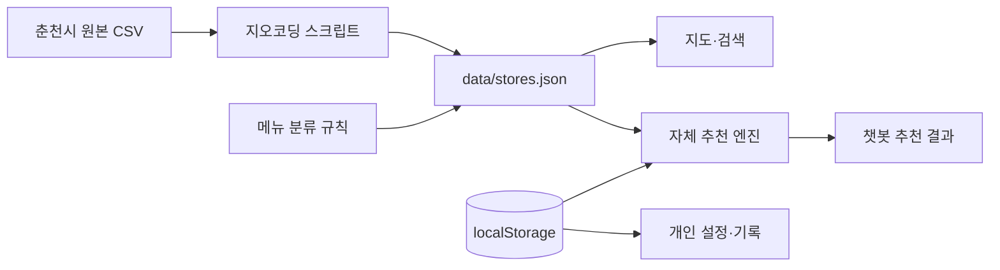

# 한끼 웹앱 개발 현황

> 작성 기준: 2026-08-18  
> 기준 커밋: `0a7f172`  
> 운영 주소: <https://child-meal-card-service.vercel.app>

## 1. 프로젝트 목적

한끼는 춘천시 아동급식카드 사용자가 현재 이용할 수 있는 가맹점을 찾고, 보유 잔액과 최근 식사, 영양 균형, 개인 만족도를 바탕으로 한 끼를 선택하도록 돕는 모바일 우선 웹앱이다.

디자인 기준은 `docs/prototypes/한끼_웹앱_v10.html`이며, 원본 HTML은 수정하지 않는다. 실제 서비스는 디자인을 Next.js 컴포넌트와 CSS로 옮겨 구현한다.

## 2. 현재 기술 구성

| 영역 | 현재 기술 | 역할 |
|---|---|---|
| 웹 프레임워크 | Next.js 16.3.1 App Router | 페이지 라우팅, 정적·동적 렌더링 |
| UI | React 19.2.8, TypeScript, CSS | 모바일 앱 형태의 화면과 상호작용 |
| 지도 | 카카오맵 JavaScript SDK | 가맹점 마커, 지도 이동, 길찾기 연결 |
| 가맹점 데이터 | 정적 JSON | 춘천시 가맹점 1,372개 제공 |
| 사용자 상태 | 브라우저 `localStorage` | 지역, 잔액, 최근 식사, 만족도, 즐겨찾기 저장 |
| 추천 | 브라우저 자체 추천 엔진 | 영양·거리·가격·만족도 기반 순위 계산 |
| 배포 | GitHub `main` + Vercel | 푸시 후 자동 빌드·배포 |

외부 생성형 AI API는 사용하지 않는다. 카카오 API는 지도 표시와 로컬 지오코딩에만 사용한다.

## 3. 구현 완료 기능

### 3.1 진입과 온보딩

- 기본 주소 접속 시마다 지역 선택 화면부터 시작
- 지역 → 카드 잔액 → 완료 순서의 온보딩
- 모바일 화면에서 금액 입력 영역과 키패드가 한 화면에 보이도록 조정
- 앱 내부 이동 중에는 온보딩을 반복하지 않고 `/home`으로 이동
- 입력한 지역과 잔액은 브라우저에 보존

### 3.2 홈과 탐색

- v10 원본 디자인을 기준으로 홈 화면 재구현
- 현재 잔액과 권장 사용액 표시
- 지도, 챗봇, 편의점 조합, 잔액, 복지, 내정보 화면 연결
- 모바일 앱 프레임 내부만 스크롤되도록 레이아웃 수정

### 3.3 지도와 가맹점

- 카카오맵 SDK 연결
- 1,372개 가맹점 좌표 표시
- 지도 페이지의 가맹점 검색 기능 복원
- 지역, 영업 여부, 예산, 혼밥, 포장 조건 필터
- 가맹점 목록 영역 독립 스크롤
- 가맹점 상세, 즐겨찾기, 길찾기, 결제 불가 제보
- 카카오 지도 키 누락 또는 도메인 미등록 상태 안내

### 3.4 챗봇

- 빠른 선택 버튼과 간단한 자유문장 의도 분류
- 음식 추천, 편의점 조합, 잔액, 복지, 지역 변경, 이용 규정 안내
- 혼밥 여부와 식사 방식 질문 후 자체 추천 엔진 실행
- 모바일에서 메시지 전송 버튼이 잘리지 않도록 입력 영역 수정

챗봇은 LLM 기반 자유대화가 아니라 정규식 의도 분류와 단계형 대화 상태를 사용한다.

### 3.5 자체 메뉴추천 AI

- 선택 지역과 현재 영업 여부로 후보 제한
- 혼밥, 포장, 예산 조건 적용
- 최근 식사 7회를 이용한 동일 음식 반복 감점
- 메뉴명 키워드로 단백질·채소·탄수화물·나트륨·당·지방 수준 추정
- 부족한 영양 요소를 보완하고 과도한 영양 요소를 줄이는 메뉴 가중치
- 거리와 가격을 포함한 식당·메뉴 점수 계산
- 최근 만족도 30회와 불만족 이유를 다음 추천에 반영
- 결제 실패 신고가 누적된 가맹점 감점
- 추천 이유를 사용자에게 설명

현재 학습은 신경망 훈련이 아니라 브라우저에 저장된 피드백으로 가중치를 조정하는 설명 가능한 개인화 방식이다. 상세 알고리즘은 `docs/개발구조_챗봇_메뉴추천AI.md`에 정리되어 있다.

### 3.6 메뉴 데이터 정합성 개선

기존에는 넓은 업종 분류만으로 메뉴를 일괄 생성해 가게와 메뉴가 맞지 않는 문제가 있었다. 이를 다음과 같이 수정했다.

- 가게명 키워드로 업종을 식별할 수 있는 473개: 이름 기반 예상 메뉴
- 중식·일식·제과점 등 세부 업종이 명확한 243개: 업종 기반 예상 메뉴
- 판단 근거가 부족한 656개: `메뉴 확인 필요` 표시
- 확인되지 않은 가게는 메뉴추천 AI 후보에서 제외
- 모든 추정 가격에 예상 정보임을 표시
- `npm run refine-menus`로 기존 좌표를 유지하며 메뉴 규칙만 재적용 가능

예상 메뉴는 실제 매장의 공식 메뉴판이 아니며, 방문 전에 매장 확인이 필요하다.

### 3.7 기타 기능

- 편의점 균형 식사 조합
- 잔액 사용 계획과 소멸 안내
- 복지 정보 목록과 상세 안내
- 내정보 화면의 색상·수정 버튼 디자인 정리
- 시연 시간 변경 기능

## 4. 주요 데이터 흐름



## 5. 저장 데이터

서버 데이터베이스와 회원가입은 아직 없다. 다음 정보는 현재 브라우저에만 저장된다.

- 선택 지역과 잔액
- 최근 식사 7회
- 만족도와 불만 이유 최근 30회
- 즐겨찾기와 결제 실패 제보
- 프로필 및 알림 설정

브라우저 데이터를 삭제하거나 다른 기기를 사용하면 개인화 정보가 이어지지 않는다. 이름, 카드번호, 실제 결제 내역은 수집하지 않는다.

## 6. 환경변수와 배포

```dotenv
NEXT_PUBLIC_KAKAO_MAP_KEY=
KAKAO_REST_API_KEY=
```

- `NEXT_PUBLIC_KAKAO_MAP_KEY`: 브라우저의 카카오 지도 표시
- `KAKAO_REST_API_KEY`: 개발 환경에서 CSV 주소를 좌표로 변환할 때만 사용
- 실제 키가 있는 `.env.local`은 Git에 포함하지 않음
- 카카오 개발자 콘솔에 로컬·운영 도메인을 허용 도메인으로 등록해야 함

배포 흐름은 다음과 같다.

```text
로컬 개발 → npm run lint → npm run build
→ Git 커밋 → GitHub main 푸시 → Vercel 자동 배포
```

## 7. 오늘 기준 검증 상태

- ESLint 통과
- Next.js 프로덕션 빌드 통과
- GitHub `main` 반영 완료
- Vercel `/result` 응답 상태 `200` 확인
- 원본 v10 HTML 미수정

## 8. 현재 한계

- 실제 매장 메뉴·가격·영업시간을 실시간으로 제공하지 않음
- 656개 가맹점은 신뢰할 메뉴를 결정하지 못해 추천에서 제외됨
- 영양 정보는 공식 영양성분이 아닌 키워드 기반 정성 추정임
- 사용자 현재 GPS 대신 선택 지역의 중심 좌표를 사용함
- 브라우저 개인화라서 기기 간 동기화와 데이터 복구가 불가능함
- 카드사 잔액·결제 여부와 연동되지 않음
- 알레르기, 질환, 종교·문화적 식이 제한을 반영하지 않음
- 자동화 테스트, 오류 모니터링, 사용 분석 체계가 충분하지 않음

## 9. 관련 문서

- `docs/개발구조_챗봇_메뉴추천AI.md`: 구조와 추천 알고리즘 상세
- `docs/기술고도화_로드맵.md`: 우선순위별 발전 방향
- `docs/결식아동_급식카드_기획서_개정1_20260814본.md`: 서비스 기획
- `docs/prototypes/한끼_웹앱_v10.html`: 수정하지 않는 디자인 원본

