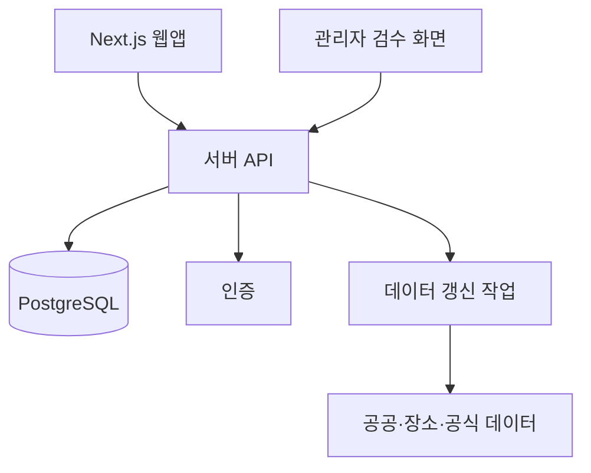

# 한끼 웹앱 기술 고도화 로드맵

> 작성 기준: 2026-08-18  
> 현재 단계: 브라우저 기반 MVP 운영

## 1. 고도화 원칙

한끼의 다음 개발은 기능 수를 늘리는 것보다 추천 근거가 되는 데이터의 신뢰도를 먼저 높이는 방향으로 진행한다.

1. 잘못된 메뉴를 추천하지 않는 것을 추천 개수보다 우선한다.
2. 아동의 식사와 관련된 서비스인 만큼 설명 가능성과 안전성을 유지한다.
3. 개인정보와 위치정보는 필요한 최소 범위에서 동의를 받은 뒤 사용한다.
4. 외부 서비스 장애가 전체 앱 장애로 이어지지 않도록 대체 동작을 둔다.
5. 사용 지표와 품질 기준을 정한 뒤 AI 또는 서버 비용을 확대한다.

## 2. 우선순위 요약

| 단계 | 목표 | 핵심 결과 |
|---|---|---|
| 1단계 | 데이터 신뢰성 확보 | 실제 메뉴·가격·영업정보의 출처와 검수 체계 |
| 2단계 | 추천 품질 개선 | 사용자 안전 조건과 객관적인 추천 평가 |
| 3단계 | 계정·서버 기반 구축 | 기기 간 동기화, 데이터 관리, 보안 |
| 4단계 | 운영 안정화 | 테스트, 모니터링, 분석, 접근성 |
| 5단계 | 학습 모델 검토 | 충분한 데이터가 쌓인 뒤 개인화 모델 실험 |

## 3. 1단계: 가맹점·메뉴 데이터 신뢰성

가장 먼저 해결할 영역이다. 추천 알고리즘이 좋아도 메뉴와 가격이 틀리면 서비스 신뢰도가 떨어진다.

### 3.1 데이터 출처 분리

각 메뉴와 가맹점 정보에 다음 메타데이터를 둔다.

```text
source: official | owner | user | inferred
verifiedAt: 마지막 확인 시각
confidence: high | medium | low
```

- 공공데이터: 가맹점 자격과 주소의 기준
- 카카오 장소 검색: 장소명, 위치, 전화번호, 영업정보 보조
- 매장 공식 채널: 메뉴와 가격의 우선 출처
- 사용자 제보: 변경 후보로 접수하고 검수 후 반영
- 추정 데이터: 화면에서 명확히 표시하고 추천 우선순위를 낮춤

카카오 API의 저장·재사용 조건과 공공데이터 이용 조건은 실제 연동 전에 약관을 확인해야 한다.

### 3.2 데이터 갱신 파이프라인

```text
원본 수집 → 형식 검증 → 중복 매칭 → 변경 비교
→ 자동 신뢰도 판정 → 검수 대기 → 운영 데이터 반영
```

필수 검증 항목은 다음과 같다.

- 주소·좌표 유효성
- 동일 매장 중복 여부
- 폐업·이전 여부
- 메뉴명과 업종의 불일치
- 가격 범위와 갱신 시각
- 원본 출처와 변경 이력

### 3.3 사용자 참여형 정정

- `메뉴가 달라요`, `가격이 달라요`, `폐업했어요` 제보 추가
- 사진 또는 공식 링크 첨부는 개인정보·저작권 검토 후 도입
- 일정 횟수의 동일 제보를 자동 반영하지 말고 관리자 검수 대상으로 전환
- 검수 완료된 제보에 확인일 표시

### 3.4 1단계 완료 기준

- 추천 노출 메뉴 중 출처가 있는 메뉴 비율 90% 이상
- 샘플 검수 기준 메뉴·업종 불일치율 5% 이하
- 모든 노출 정보에 출처와 확인일 존재
- 갱신 실패 시 기존 데이터로 서비스가 정상 작동

## 4. 2단계: 추천 품질과 안전성

### 4.1 사용자 조건 확장

- 알레르기와 먹지 못하는 재료
- 매운맛 선호
- 채식 또는 종교·문화적 제한
- 식사량 선호
- 이동 가능 거리
- 가격 상한

알레르기는 추천 가점이 아니라 후보에서 제외하는 강한 안전 필터로 다룬다. 다만 메뉴 원재료 정보가 불완전하므로 `안전 보장`으로 표현하지 않고 매장 확인 안내를 함께 제공한다.

### 4.2 영양 데이터 개선

- 식품의약품안전처 등 공식 영양 데이터와 표준 메뉴 연결
- 1회 제공량과 단위를 명확히 저장
- 매칭되지 않는 메뉴는 현재의 정성 추정을 유지하되 신뢰도 표시
- 아동 대상 권장량을 적용할 경우 영양 전문가 검토
- 질환 진단이나 치료 목적의 표현은 사용하지 않음

### 4.3 위치와 접근성

- 명시적 동의 후 브라우저 GPS 사용
- 직선거리와 실제 도보 경로를 구분
- 경사, 대중교통, 휠체어 접근성과 같은 이동 정보는 신뢰할 출처가 있을 때 추가
- 위치 권한을 거부하면 현재 동네 중심점 방식 유지

### 4.4 추천 평가 체계

추천 엔진을 변경하기 전에 익명화된 평가 지표를 정의한다.

- 추천 결과 클릭률
- 방문 또는 식사 완료율
- 만족·보통·아쉬움 비율
- 같은 메뉴 반복률
- 예산 초과율
- 메뉴 정보 오류 제보율
- 특정 지역·업종에 대한 노출 편향

오프라인 테스트용 고정 시나리오도 만든다. 예를 들어 저예산, 늦은 시간, 채소 부족, 거리 불만 누적 상황마다 예상 추천 조건을 명시한다.

### 4.5 2단계 완료 기준

- 핵심 추천 시나리오 자동 테스트 구축
- 사용자 안전 조건이 모든 추천 경로에 동일하게 적용
- 만족도 개선을 A/B 테스트 또는 전후 비교로 확인
- 추천 결과에 선택 이유와 정보 신뢰도 표시

## 5. 3단계: 계정과 서버 구조

브라우저 저장만으로 검증할 수 없는 요구가 생길 때 서버를 도입한다. 회원가입부터 먼저 만드는 방식은 피하고, 기기 동기화나 관리자 검수처럼 서버가 꼭 필요한 기능부터 정의한다.

### 5.1 제안 구조



초기에는 Vercel Functions와 관리형 PostgreSQL 조합을 검토할 수 있다. 특정 공급자를 결정하기 전에 예상 사용자 수, 지역 확장 범위, 비용, 개인정보 보관 위치를 비교한다.

### 5.2 데이터 모델 후보

- `users`: 최소 계정 식별자와 동의 상태
- `preferences`: 알레르기, 선호, 예산, 이동 범위
- `stores`: 가맹점 기본정보와 검증 상태
- `menus`: 메뉴, 가격, 영양, 출처, 확인일
- `meal_events`: 추천·선택·식사 완료
- `feedback`: 만족도와 불만 이유
- `reports`: 사용자 정정·결제 실패 제보
- `audit_logs`: 관리자 변경 이력

### 5.3 보안과 개인정보

- 수집 목적, 보관 기간, 삭제 방법을 먼저 문서화
- 위치·식사·아동 관련 데이터 최소 수집
- 전송 구간 암호화와 서버 저장 암호화
- 사용자별 접근 제어와 관리자 권한 분리
- 계정·기록 삭제 및 데이터 내보내기 기능
- 비밀키를 서버 환경변수에 저장하고 브라우저에 노출하지 않음
- 로그에 토큰, 위치 원본, 개인 식사 내역을 남기지 않음
- 정기적인 의존성·권한·취약점 점검

## 6. 4단계: 운영 품질

### 6.1 테스트

- 단위 테스트: 영양 추정, 메뉴 규칙, 추천 점수, 잔액 계산
- 통합 테스트: 온보딩부터 추천·피드백 저장까지
- E2E 테스트: 모바일 화면, 지도 실패, 새 브라우저 재접속
- 데이터 테스트: 좌표, 중복, 빈 메뉴, 가격, 출처 검증
- 시각 회귀 테스트: v10 원본과 주요 화면 비교

### 6.2 관측과 장애 대응

- 클라이언트 오류와 서버 오류 수집
- Vercel 배포 상태와 핵심 페이지 상태 확인
- 카카오 지도 로드 실패율 측정
- 데이터 갱신 성공·실패 알림
- 장애 시 지도 없는 목록 화면과 마지막 정상 데이터 제공
- 복구 절차와 담당자를 운영 문서로 정리

### 6.3 성능과 접근성

- 지도 마커 클러스터링 또는 화면 영역 기반 렌더링
- 긴 가맹점 목록 가상화
- 정적 데이터 분할과 캐시 전략
- 느린 모바일 네트워크 기준 성능 측정
- 키보드 탐색, 명확한 포커스, 스크린리더 레이블
- 색 대비, 글자 확대, 터치 영역 점검

## 7. 5단계: 학습형 추천 모델

현재 규칙 기반 개인화는 데이터가 적고 설명 가능성이 중요한 MVP에 적합하다. 다음 조건이 충족되기 전에는 별도 머신러닝 모델을 우선 도입하지 않는다.

- 신뢰할 수 있는 실제 메뉴 데이터 확보
- 충분한 추천·선택·만족도 표본 확보
- 사용자 동의와 익명화 정책 마련
- 규칙 기반 기준 모델과 평가 지표 구축
- 지역·가격·업종별 편향 검증 가능

조건이 충족되면 다음 순서로 실험한다.

1. 로지스틱 회귀 또는 경량 랭킹 모델로 만족 확률 예측
2. 규칙 기반 안전 필터 뒤에서 후보 순서만 조정
3. 신규 사용자에게는 기본 규칙을 사용하는 콜드스타트 전략 유지
4. 모델 버전, 입력 특성, 평가 결과 기록
5. 성능이 낮아지면 즉시 규칙 기반 추천으로 되돌릴 수 있게 구성

생성형 AI는 메뉴 순위를 결정하는 핵심 엔진보다 추천 이유의 자연어 표현이나 운영자용 데이터 정리 보조에 제한적으로 검토한다. 실제 가게·메뉴·가격은 검증된 데이터베이스에서만 가져와야 한다.

## 8. 권장 실행 순서

### 가까운 다음 개발

1. 메뉴·가맹점 데이터에 출처, 신뢰도, 확인일 필드 추가
2. 사용자 메뉴 오류 제보와 관리자 검수 상태 설계
3. 추천 로직 단위 테스트와 고정 시나리오 테스트 추가
4. 알레르기·못 먹는 음식 설정과 강제 제외 필터 설계
5. 지도 마커가 많은 상황의 성능 측정과 클러스터링 적용

### 그다음 개발

1. 공식 메뉴·영양 데이터 수집 가능성 검증
2. GPS 동의와 실제 거리 계산
3. 익명 사용 지표와 오류 모니터링 도입
4. 서버가 필요한 기능의 요구사항과 개인정보 영향 분석
5. 관리형 데이터베이스와 인증 방식 비교 후 작은 범위로 도입

## 9. 당장 도입하지 않을 항목

- 근거 데이터 없이 메뉴를 생성하는 생성형 AI
- 사용자 동의 없는 위치·식사 기록 서버 전송
- 공식 카드사 협의 없는 실시간 잔액·결제 성공 표시
- 영양 전문가 검토 없는 질환별 식단 처방
- 데이터 표본이 부족한 상태의 복잡한 딥러닝 모델

## 10. 문서 관리

- 기능 배포 시 `docs/개발현황_YYYYMMDD.md`에 구현 범위와 검증 결과를 갱신한다.
- 추천 점수나 저장 항목이 바뀌면 `docs/개발구조_챗봇_메뉴추천AI.md`도 함께 갱신한다.
- 외부 API, 개인정보, 데이터 출처가 바뀌면 이 로드맵과 기획서를 함께 검토한다.
- 로드맵 항목은 구현 완료, 진행 중, 보류 상태로 관리하고 완료 기준을 근거로 종료한다.

